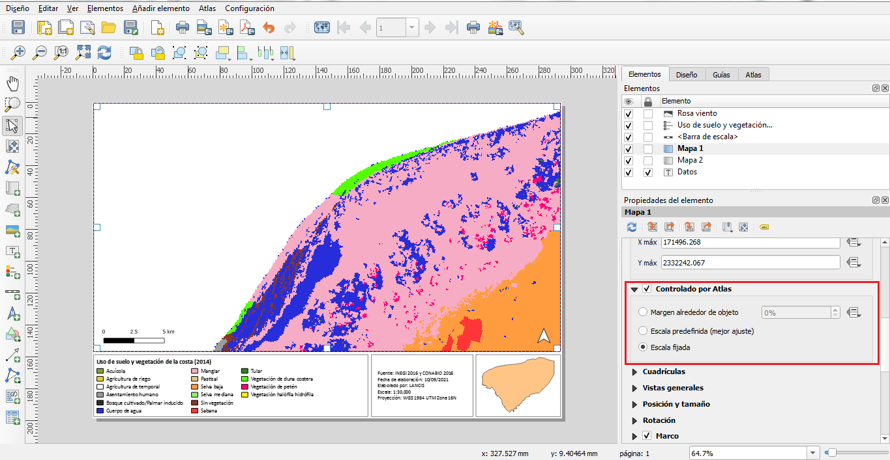
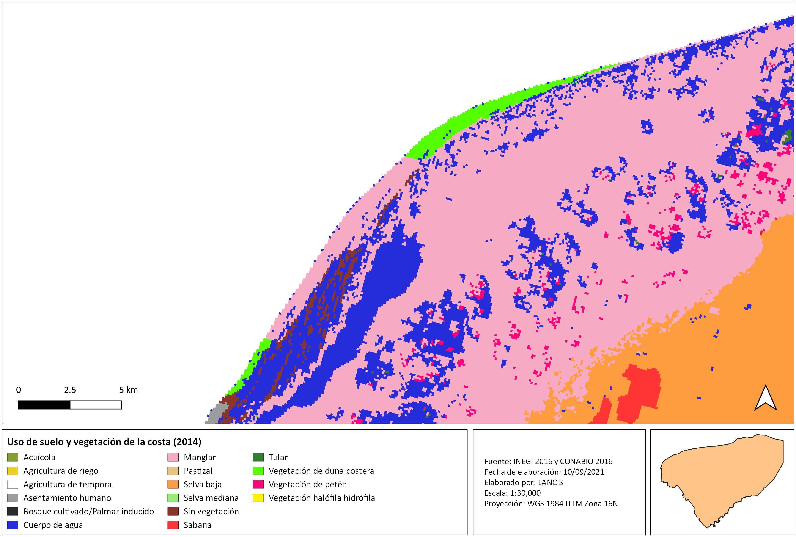

# Manual para la composición de mapas y atlas en QGIS 

* * *

## Objetivo y alcance

**Objetivo:** 

Mostrar como crear composiciones de  proyectos mediante el complemento de QGIS: Lizmap, a través de (1) la explicación de como preparar un proyecto QGIS para publicarlo en la web y (2) como configurar un proyecto para Lizmap.

**Alcance:** 

Para los colaboradores del APC

* * *

## Materiales, equipos y reactivos

- QGIS 

* * *

## Actividades y responsables

No aplica

### Diseñador de impresión en QGIS

1. Crear un proyecto en Qgis, cargar capas raster o vectoriales y establecer sus propiedades de acuerdo a lo que se desee representar en el mapa.

2. Para comenzar a diseñar un mapa con QGIS se debe agregar una composición de impresión (pestaña proyecto ‣ nueva composición de impresión). Después de ponerle un título a la composición, se desplegará una ventana en donde se trabajará el diseño del mapa: 


**Administrador de composiciones:**

Desde la ventana del 'Administrador de composiciones' (pestaña proyecto ‣ administrador de composiciones) se pueden administrar los diseños de impresión del proyecto, crear nuevas composiciones (desde cero o utilizando una plantilla), abrir las composiciones guardadas, renombrar y eliminar composiciones. 


### Diseñador de impresión en QGIS

**Menús, herramientas y paneles:**

1. Para comenzar a diseñar un mapa con QGIS se debe agregar una composición de impresión (pestaña proyecto ‣ nueva composición de impresión o pestaña proyecto ‣ administrador de composiciones ‣ crear). Después de ponerle un título a la composición, se desplegará una ventana en donde se trabajará el diseño del mapa: 


**Barra de herramientas composiciones**

En esta barra de herramientas se encuentran las funciones (de izquierda a derecha): guardar proyecto,  


### Añadir elementos a la composición de impresión

**Propiedades del mapa:**

1. Hacer clic sobre el botón 'Añadir mapa' y, manteniendo el botón izquierdo del ratón presionado, trazar un rectángulo en la ventana del 'Diseñador de impresión' para agregar el área del mapa. Dentro del rectángulo dibujado, se mostrará el lienzo del mapa de QGIS. Con el botón 'Mover contenido del elemento' o en la caja de 'Propiedades del elemento' se puede ajustar la escala del mapa.


**Escala gráfica:** 

2. Para agregar una escala gráfica, hacer clic sobre el botón 'Añadir una nueva barra de escala' y colocarla en la ubicación deseada. Desde la caja 'Propiedades del elemento' se puede modificar el estilo, las unidades, la fuente y tamaño de la letra, etc. 


**Norte:**

3.


### Configuración del proyecto para Lizmap 

1. Instalar el complemento Lizmap {#instalacion}

El complemento Lizmap está disponible a través del repositorio oficial del proyecto QGIS: http://plugins.qgis.org/plugins/lizmap/ . Para instalarlo seguir el procedimiento:

- Menú ‣ Complementos ‣ Administrar e instalar complementos
- Buscar Lizmap
- Instalar el complemento
El complemento aparecerá en el menú y en la barra de herramientas Web


#### Organización del complemento Lizmap 

El complemento está organizado en 13 pestañas:

- Opciones del mapa: las opciones generales del mapa
- Capas: las opciones de cada capa
- Capas base: las capas base utilizadas en la Web
- Locate by layer: la lista desplegable que da la capacidad de hacer zoom en uno o más objetos espaciales de la capa
- Tabla de atributos: las tablas de atributos de las capas vectoriales agregadas
- Edición de capa: las capacidades de edición para cada capa
- Capas de herramientas de ayuda: la información sobre las herramientas del mapa disponibles para el usuario
- Filtrar por usuario: los filtros aplicados para mostrar a los usuarios
- Visualización de datos: la creación de gráficas a partir de capas
- Gestor de tiempos: las animaciones a partir de las capas vectoriales que contengan un atributo de fecha u hora
- Atlas: la configuración de los atributos de una capa para hacer una secuencia
- Filter data with form: los formularios que permite buscar entre los datos de una capa
- Log: la información de las acciones realizadas




2. Abrir el complemento Lizmap para configurar las capas

__Pestaña "Opciones del mapa"__: En esta pestaña se habilitan o deshabilitan las herramientas básicas de Lizmap, eligiendo escalas y la extensión inicial.

- Activar las casillas: medir e historia de zoom. 
- En la extensión inicial del mapa se puede elegir entre ajustar a partir de las propiedades del proyecto o ajustar a partir del canvas del mapa.


__Pestaña "Capas"__: La configuración de la capas se realiza en esta pestaña, para ello se debe seleccionar una capa o grupo y agregar la siguiente información:

- Colocar el título de la capa (es el que se mostrará en el Lizmap)
- En "enlace" colocar la url del metadato de Geonetwork
- Activar la casilla "display in legend tree" (hacer esto para todas las capas cargadas en el proyecto).
- Si se desea que una capa se muestra predeterminadamente en el proyecto web de Lizmap sin necesidad de activarla manualmente (p.ej. la capa de límites municipales), se debe activar la casilla "toggled"


__Pestaña "Capas base"__: Esta pestaña permite agregar servicios externos como capas base y una capa base vacía, la capa base vacía mostrará las capas temáticas sobre el color de fondo del proyecto. Las capas base no forman parte de la leyenda y se presentan como una lista.


__Pestaña "Tabla de atributos"__: En esta pestaña se activa la opción para mostrar en el Lizmap la tabla de atributos de las capas vectoriales.

- Dar clic en el botón + y seleccionar cada una de las capas vectoriales, eligiendo en cada caso la "primary key" (puede ser el campo: id, id_municipio, id_edo, etc).



- Guardar el proyecto al finalizar 


**Nota:** Los pasos explicados en esta sección son los básicos que hasta el momento se utilizan para crear proyectos Lizmap en el ACP, sin embargo, este complemento cuenta con muchos otros recursos que se recomiendan implementar de acuerdo con los objetivos de los proyectos. Como información adicional, se puede revisar la guía de usuario para el uso de Lizmap:

```
https://lancis-apc.github.io/SVACC/lizmap.html
```

### Publicación del mapa


### Herramientas para la visualización web

* * *

## Referencias


Lizmap 3.2. Publisher guide. (2014). Lizmap Documentation. https://docs.lizmap.com/current/es/publish/index.html

* * *
