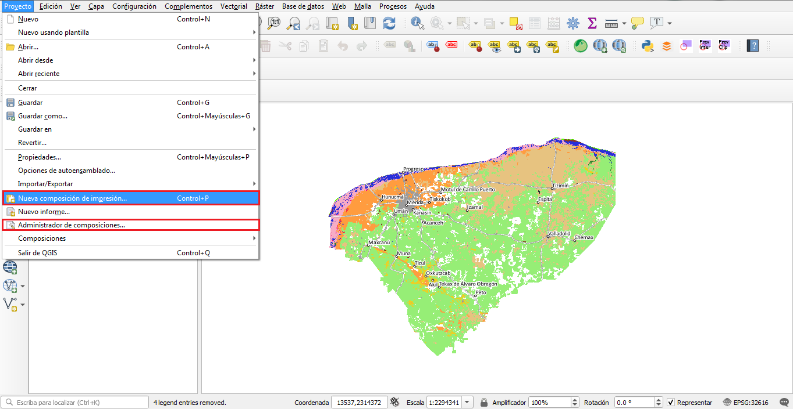
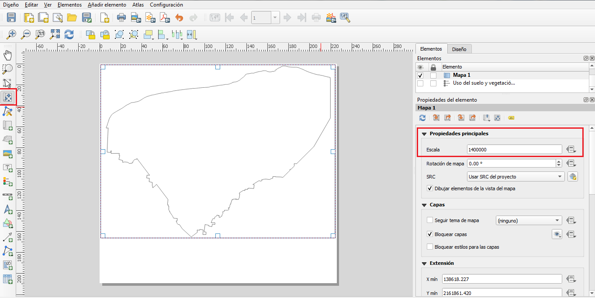
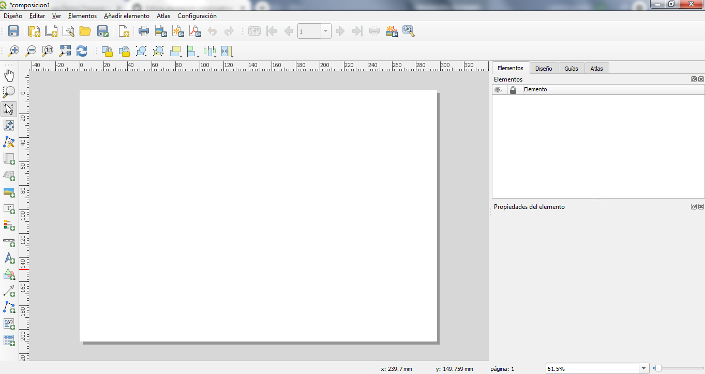
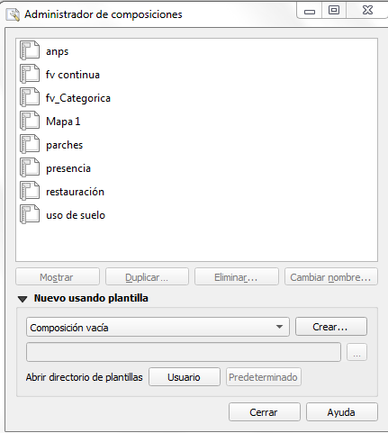
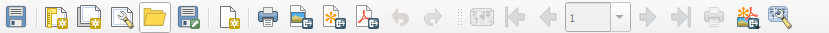
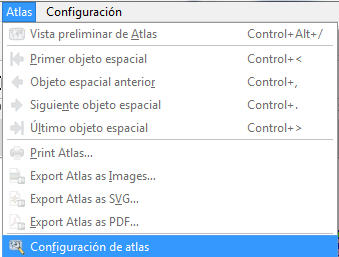
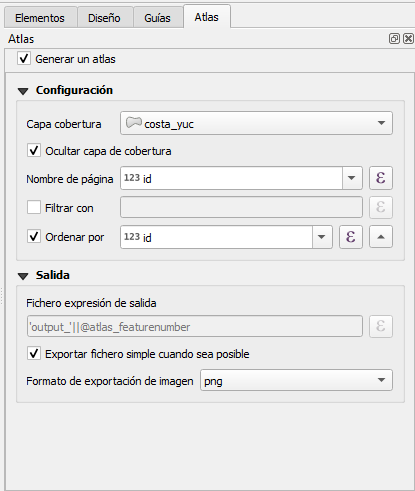
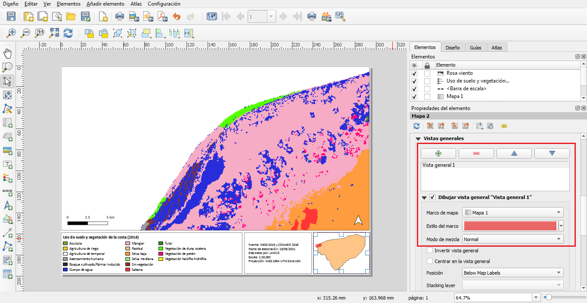
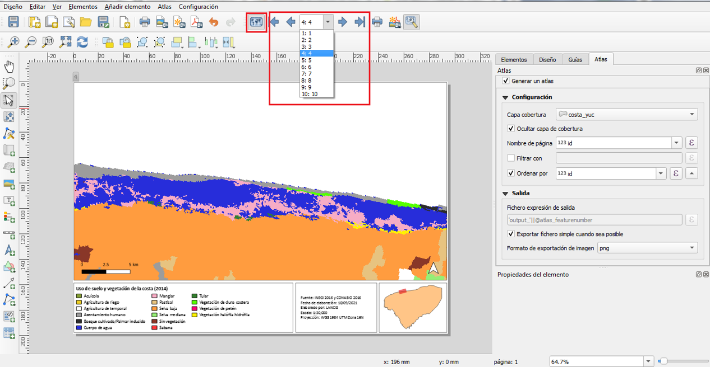

# Manual para la composición de mapas y atlas en QGIS 

* * *

## Objetivo y alcance

**Objetivo:** 

Mostrar como crear composiciones de mapas mediante QGIS: a través de dos ejemplos que explican (1) como crear un mapa de manera general y (2) como crear un atlas.

**Alcance:** 

Para los colaboradores del APC

* * *

## Materiales, equipos y reactivos

- QGIS 

* * *

## Actividades y responsables

No aplica

### Diseñador de impresión en QGIS

La herramienta 'Composición de Impresión' de QGIS permite crear mapas, agregando elementos como: imágenes de las capas geográficas, etiquetas de texto, barra de escala, leyenda, norte, figuras, tablas de atributos, entre otros. A continuación con un ejemplo se mostrará como crear un mapa de manera general utilizando los elementos estándar de QGIS:

1.	Crear un proyecto en QGIS, cargar capas raster o vectoriales y establecer sus propiedades de acuerdo a lo que se desee representar en el mapa.

2.	Para comenzar a diseñar un mapa se debe agregar una composición de impresión (pestaña proyecto ‣ nueva composición de impresión o pestaña proyecto ‣ administrador de composiciones ‣ crear). Después de ponerle un título a la composición, se desplegará una ventana en donde se trabajará el diseño del mapa.

**Administrador de composiciones:**

Desde la ventana del 'Administrador de composiciones' (pestaña proyecto ‣ administrador de composiciones) se pueden administrar los diseños de impresión del proyecto, crear nuevas composiciones (desde cero o utilizando una plantilla), abrir las composiciones guardadas, renombrar y eliminar composiciones. 

**Menús, herramientas y paneles:**

Dentro de la ventana 'Composición de impresión' se encuentran varias barras de herramientas y paneles; para conocer a detalle la utilidad de cada uno de los botones basta con colocar el cursor sobre el botón para que se despliegue una leyenda indicando su nombre, también se puede consultar literatura adicional como la [Guía de usuario de QGIS] (https://docs.qgis.org/3.10/es/docs/user_manual/print_composer/overview_composer.html)

### Añadir elementos a la composición de impresión

**Propiedades del mapa**

1.	Hacer clic sobre el botón 'Añadir mapa' y, manteniendo el botón izquierdo del ratón presionado, trazar un rectángulo en la ventana del 'Diseñador de impresión' para agregar el área del mapa. Dentro del rectángulo dibujado, se mostrará una imagen de las capas que estén activadas en el panel 'Capas' de la pantalla principal de QGIS.
2.	Con el botón 'Mover contenido del elemento' ubicado en la 'Caja de herramientas' o desde el panel 'Propiedades del elemento' se puede ajustar la escala del mapa para mejorar su visualización.
3.	En el panel 'Propiedades del elemento' activar la casilla 'Bloquear capas' y 'Bloquear estilos para las capas', para que la imagen del mapa no presente cambios aún cuando se modifique la simbología o se desactiven las capas desde la pantalla principal de QGIS.

**Escala gráfica y norte**

4.	Para agregar una escala gráfica, hacer clic sobre el botón 'Añadir una nueva barra de escala' y colocarla en la ubicación deseada. Desde la caja 'Propiedades del elemento' se puede modificar el estilo, las unidades, la fuente y tamaño de la letra, etc.

5.	El norte se agrega dando clic sobre el botón 'Añadir una nueva flecha de norte'; dentro del panel 'Propiedades del elemento' en la sección 'Directorios de búsqueda' se puede elegir una flecha de norte entre los diseños preestablecidos.

**Leyenda**

6.	La leyenda se agrega desde la 'Caja de herramientas' con el botón 'Añade una nueva leyenda a la composición'.
7.	Colocar un título a la leyenda.
8.	Desactivar el botón 'Auto actualizar', de esta manera se podrá manipular el orden de las capas, cambiarles los nombres y eliminar capas que no se quieran mostrar en la leyenda.
9.	Dando clic derecho sobre el título de una capa con simbología categorizada o graduada, se puede ocultar el nombre de la capa para solo mostrar los nombres de los elementos de la misma.
10.	Otras de las acciones que se pueden hacer dentro del panel 'Propiedades del elemento' de la leyenda son: cambiar el tamaño del símbolo, el tamaño y tipo de letra, la separación entre elementos, etc.

**Cuadro de texto**

11.	Para agregar un cuadro de texto, se debe hacer clic en el botón 'Añade una nueva etiqueta a la composición', en este caso esta herramienta se utilizó para agregar datos sobre la fuente, la fecha de elaboración, la escala numérica y la proyección.

12. Los mapas en QGIS se pueden imprimir o exportar a formatos de imagen, SVG o PDF. Para ello, solo hay que seleccionar desde la pestaña 'Diseño' o utilizando los íconos dentro de la 'Barra de herramientas Composiciones' el formato en el que se quiera exportar el mapa. 

### Atlas

La herramienta 'Atlas' de QGIS permite crear varios mapas utilizando la misma plantilla, especialmente si se desean mostrar áreas contiguas, por ejemplo un mapa por unidad administrativa o por región de interés. 

1. Crear una composición de impresión utilizando las herramientas que se explican en la primera parte de este manual, en este caso se agregan dos mapas, ya que uno se mostrará con una mayor escala y con más detalle y el otro servirá para indicar que zona es la que se está observando; en este ejemplo se representa el uso de suelo y vegetación en la zona costera del estado de Yucatán.

2. Dentro de la composición de impresión, en la pestaña 'Atlas' seleccionar 'Configuración de Atlas'. 

3. Dentro del panel 'Atlas' activar la casilla 'Generar un atlas', como capa de cobertura escoger una capa que sirva de base para que el Atlas haga un desplazamiento, por ejemplo: la capa de municipios, o en este ejemplo se utiliza una capa que divide a la costa de Yucatán en 10 partes, haciendo un corte cada 33 km. Esto indicará que queremos crear un mapa por cada entidad polígono. Si no queremos que esta capa se muestre en el mapa, se debe dar click en la casilla 'ocultar capa de cobertura'.

4. Dentro del panel 'Propiedades del elemento' del Mapa 1 se debe activar la casilla 'Controlado por Atlas'.

5. Para el Mapa 2 en el panel 'Propiedades del elemento' se agrega una 'Vista general' y se establece el Mapa 1 como 'Marco del mapa', de esta manera aparecerá un recuadro que indica que zona del territorio se está mostrando en el Mapa 1. 

6. Finalmente, dar click sobre el botón 'Vista preliminar del Atlas', esto generará el conjunto de mapas. Dando click sobre las flechas se muestran los mapas creados.

7. Al igual que los mapas, los Atlas se pueden exportar en formatos de imagen, SVG o PDF. Para ello se deben utilizar los íconos que se encuentran en la 'Barra de herramientas Atlas'.

### Guardar y cargar una plantilla

1. Los diseños generados se pueden guardar como plantillas y volver a cargarlos en otra sesión, para ello en la pestaña 'Diseño' se debe seleccionar la opción 'Guardar como plantilla'. 

2. Para cargar una plantilla guardada, se debe crear una nueva composición de impresión y desde la pestaña 'Diseño' seleccionar la opción 'Añadir elementos desde plantilla'. 

* * *

## Referencias

Manual de Aprendizaje QGIS. 4.1. Lesson: Usando el Compositor de impresión (2020). https://docs.qgis.org/3.10/es/docs/training_manual/map_composer/map_composer.html

* * *
