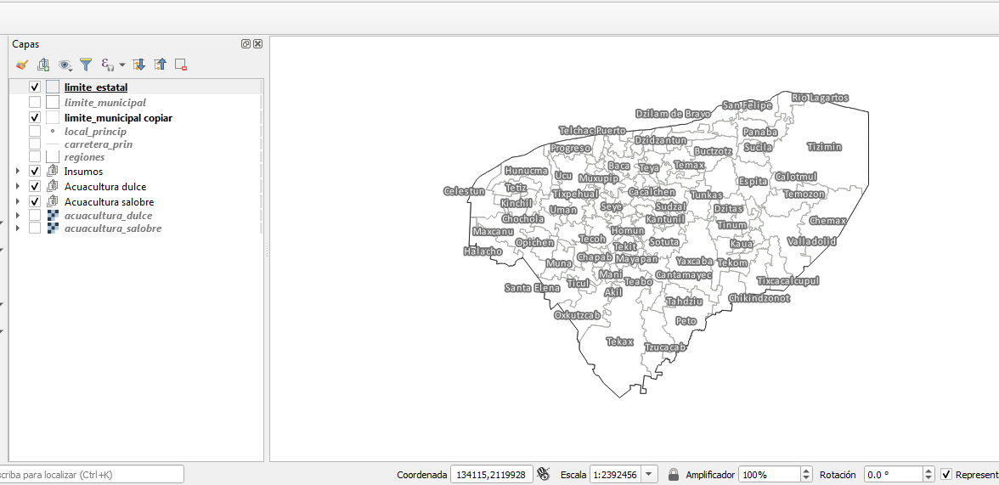
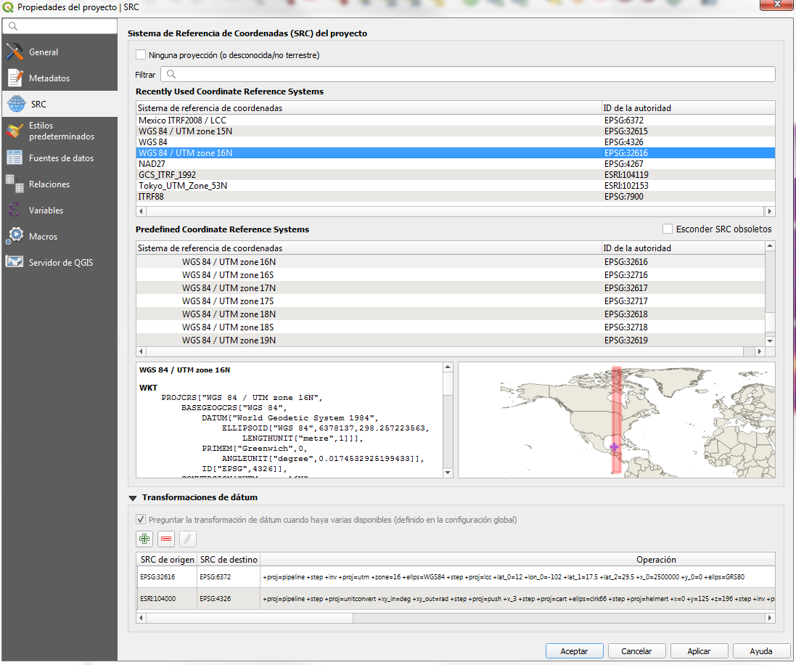
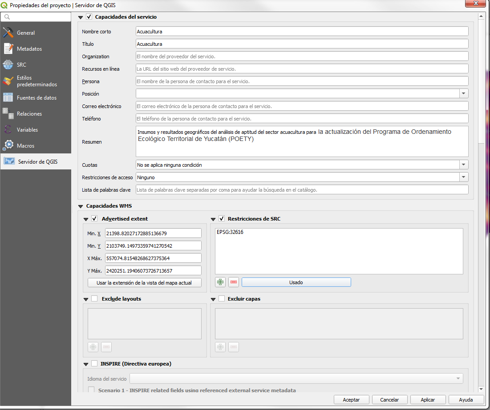
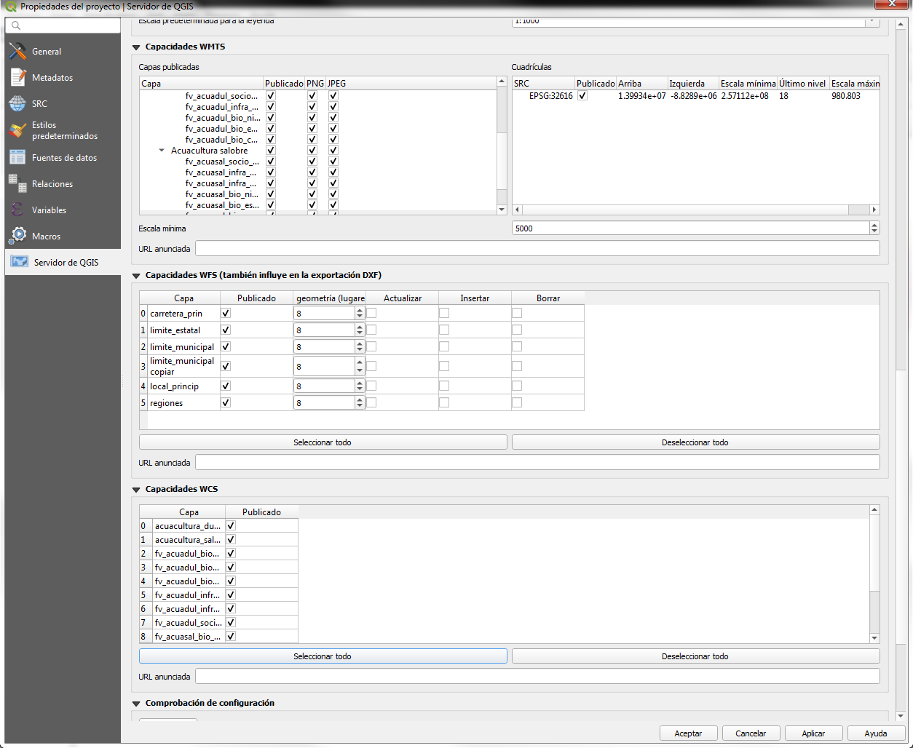
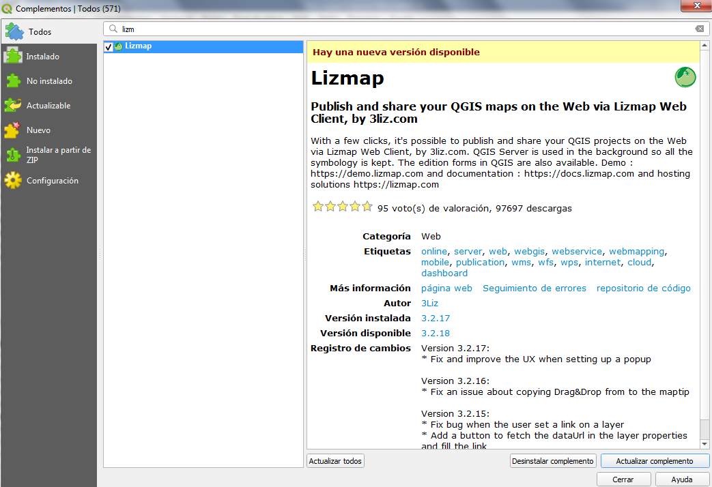
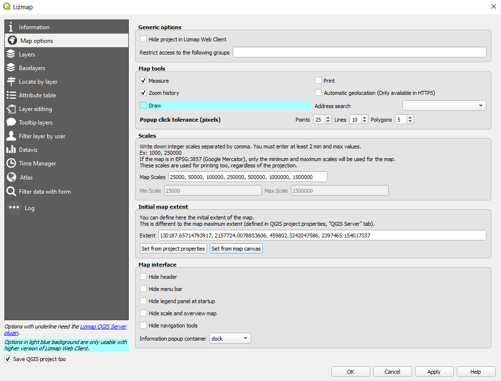
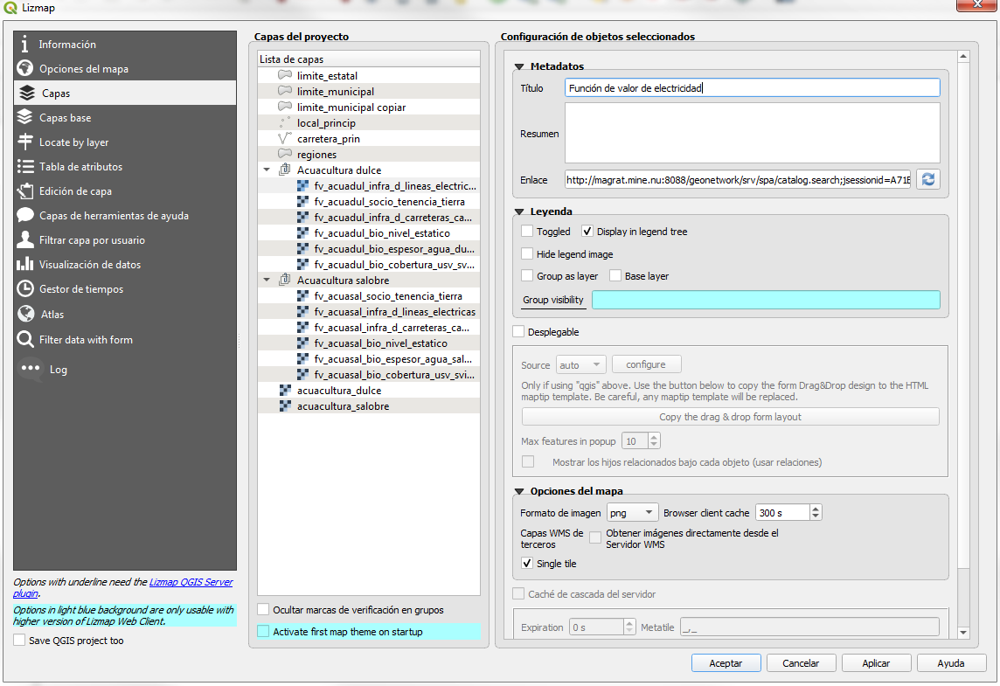
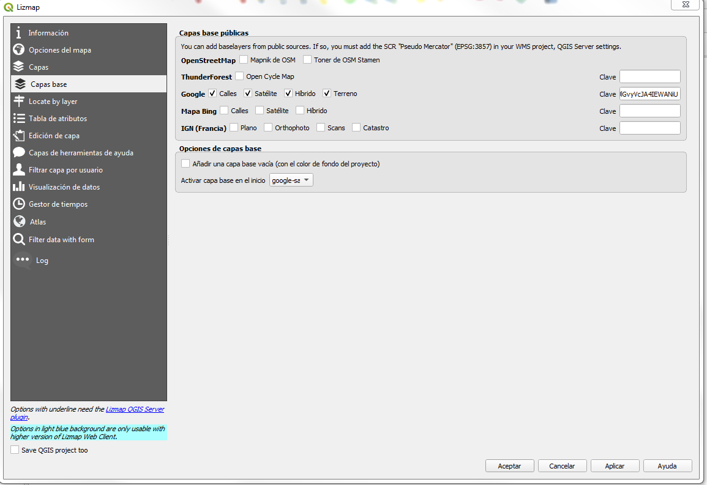
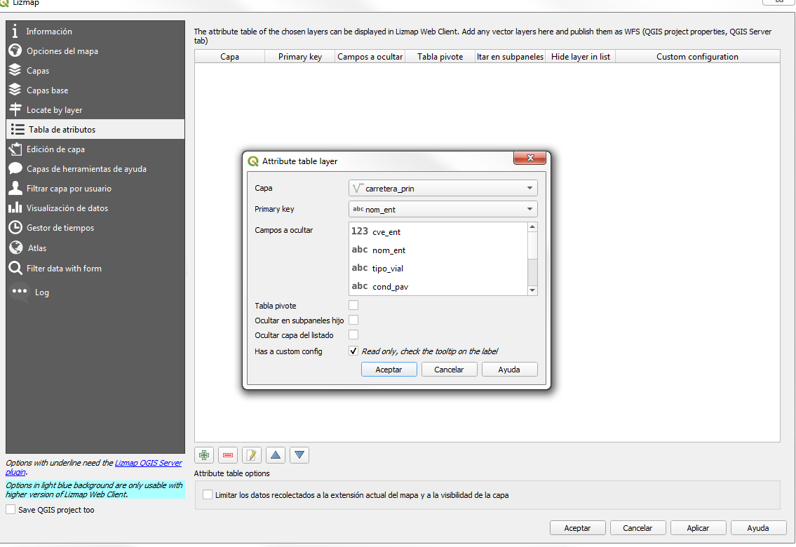

# Manual para la creación de Lizmap

* * *

## Objetivo y alcance

**Objetivo:** 

Mostrar como publicar proyectos mediante el complemento de QGIS: Lizmap, a través de (1) la explicación de como preparar un proyecto QGIS para publicarlo en la web y (2) como configurar un proyecto para Lizmap.

**Alcance:** 

Para los colaboradores del APC

* * *

## Materiales, equipos y reactivos

Tener descargado QGIS e instalar el complemento Lizmap [Ver: Instalar el complemento Lizmap](#instalación)

* * *

## Actividades y responsables

No aplica

### Creación del proyecto 

1. Crear una carpeta en ```SIG/``` con el nombre del proyecto y guardar en ella los archivos de información geográfica que se deseen mostrar en el Lizmap, esto con el fin de (....). (Se recomienda incluir capas de referencia geográfica, por ejemplo: límite estatal, límite municipal, localidades principales con etiquetas activadas, carreteras, etc).

2. Crear un proyecto en Qgis y añadir las capas raster o vectoriales que contendrá el Lizmap, el proyecto debe quedar guardado al mismo nivel de la carpeta del paso anterior en formato .qgs.

3. Establecer la simbología de cada una de las capas geográficas según la información que se quiera comunicar, en caso de ser necesario hacer agrupaciones para organizar la información.


  

### Configuración del proyecto para la web 

1. Configurar el sistema de referencia de coordenadas CRS del proyecto (pestaña proyecto ‣ propiedades del proyecto), por ejemplo:

- EPSG:32616 - WGS 84 / UTM zone 16N - Proyectado
- EPSG:4326 - WGS 84
- etc




2. Configurar las propiedades del servidor de QGIS

- Activar la casilla "Capacidades del servicio"
- Colocar nombre, título y resumen del proyecto
- Activar la casilla "Advertised extend", para configurar la extensión máxima de visualización, se puede utilizar la extensión de la vista actual del mapa o configurar una extensión más específica. 
- Seleccionar "Restricciones del SRC" y dar clic en el botón "Usado"
- En las secciones "Capacidades WMTS", "Capacidades de WFS" y "Capacidades WCS", activar las casillas de las capas que se desean mostrar en el Lizmap, si se quieren mostrar todas las capas dar clic en los botones "seleccionar todo".






### Configuración del proyecto para Lizmap 

1. Instalar el complemento Lizmap {#instalacion}

El complemento Lizmap está disponible a través del repositorio oficial del proyecto QGIS: http://plugins.qgis.org/plugins/lizmap/ . Para instalarlo seguir el procedimiento:

- Menú ‣ Complementos ‣ Administrar e instalar complementos
- Buscar Lizmap
- Instalar el complemento
El complemento aparecerá en el menú y en la barra de herramientas Web



#### Organización del complemento Lizmap 

El complemento está organizado en 13 pestañas:

- Opciones del mapa: las opciones generales del mapa
- Capas: las opciones de cada capa
- Capas base: las capas base utilizadas en la Web
- Locate by layer: la lista desplegable que da la capacidad de hacer zoom en uno o más objetos espaciales de la capa
- Tabla de atributos: las tablas de atributos de las capas vectoriales agregadas
- Edición de capa: las capacidades de edición para cada capa
- Capas de herramientas de ayuda: la información sobre las herramientas del mapa disponibles para el usuario
- Filtrar por usuario: los filtros aplicados para mostrar a los usuarios
- Visualización de datos: la creación de gráficas a partir de capas
- Gestor de tiempos: las animaciones a partir de las capas vectoriales que contengan un atributo de fecha u hora
- Atlas: la configuración de los atributos de una capa para hacer una secuencia
- Filter data with form: los formularios que permite buscar entre los datos de una capa
- Log: la información de las acciones realizadas


2. Abrir el complemento Lizmap para configurar las capas

__Pestaña "Opciones del mapa"__: En esta pestaña se habilitan o deshabilitan las herramientas básicas de Lizmap, eligiendo escalas y la extensión inicial.

- Activar las casillas: medir e historia de zoom. 
- En la extensión inicial del mapa se puede elegir entre ajustar a partir de las propiedades del proyecto o ajustar a partir del canvas del mapa.



__Pestaña "Capas"__: La configuración de la capas se realiza en esta pestaña, para ello se debe seleccionar una capa o grupo y agregar la siguiente información:

- Colocar el título de la capa (es el que se mostrará en el Lizmap)
- En "enlace" colocar la url del metadato de Geonetwork
- Activar la casilla "display in legend tree" (hacer esto para todas las capas cargadas en el proyecto).
- Si se desea que una capa se muestra predeterminadamente en el proyecto web de Lizmap sin necesidad de activarla manualmente (p.ej. la capa de límites municipales), se debe activar la casilla "toggled"




__Pestaña "Capas base"__: Esta pestaña permite agregar servicios externos como capas base y una capa base vacía, la capa base vacía mostrará las capas temáticas sobre el color de fondo del proyecto. Las capas base no forman parte de la leyenda y se presentan como una lista.



__Pestaña "Tabla de atributos"__: En esta pestaña se activa la opción para mostrar en el Lizmap la tabla de atributos de las capas vectoriales.

- Dar clic en el botón + y seleccionar cada una de las capas vectoriales, eligiendo en cada caso la "primary key" (puede ser el campo: id, id_municipio, id_edo, etc).



- Guardar el proyecto al finalizar 


**Nota:** Los pasos explicados en esta sección son los básicos que hasta el momento se utilizan para crear proyectos Lizmap en el ACP, sin embargo, este complemento cuenta con muchos otros recursos que se recomiendan implementar de acuerdo con los objetivos de los proyectos. Como información adicional, se puede revisar la guía de usuario para el uso de Lizmap:

```
https://lancis-apc.github.io/SVACC/lizmap.html
```

* * *

## Referencias


Lizmap 3.2. Publisher guide. (2014). Lizmap Documentation. https://docs.lizmap.com/current/es/publish/index.html

* * *
