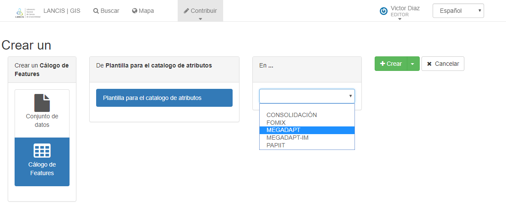
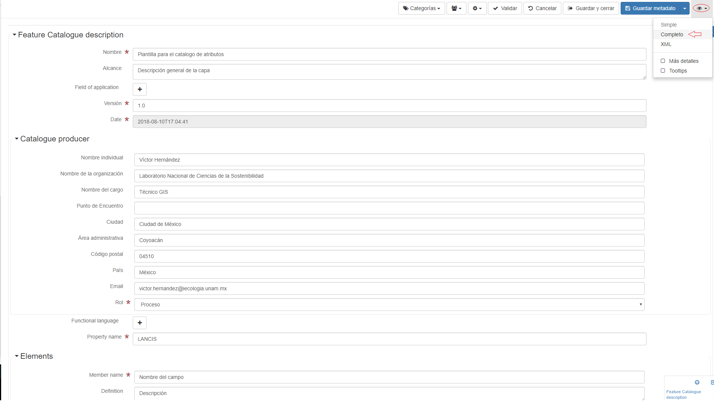
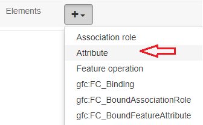

# Creación de metadatos geográficos con GeoNetwork

## Introdución
GeoNetwork es un sistema basado en estándares para la gestión y creación de metadatos geográficos. Esta será la plataforma que se usará en APC para:

- La creación de metadatos geográficos a partir de plantillas.
- Gestionar la información geográfica de los diversos proyectos realizados en APC, facilitando la búsqueda de las capas necesarias en un entorno web de fácil uso.


### Estándares para la generación de metadatos geográficos.

Para cada capa generada en APC se generarán dos metadatos:

#### 1. Metadato del conjunto de datos.
En APC se adopta el estándar NOM-ISO-19139 que es la norma que describe la implementación reglada y codificada del estándar NOM-ISO-19115 a nivel de capa y de serie. Presenta esquemas XML especificos para la descripción, validación e intercambio de datos.

#### 2. Metadato del catálogo de atributos.
En APC se adopta el estándar NOM-ISO 19110 el cual permite la descripción de los atributos y sus relaciones.

## Cuenta de usuario.
La cuenta de usurio le permite crear los metadatos asociados a las capas geográficas
de las cuales es responsable.
Para acceder a la plataforma de GeoNetwork

### Solicitud de cuenta

Rellenar el siguiente formulario:
- https://goo.gl/forms/8QPOSjQVi4yMvEo53

### Ingreso a geonetwork:

La dirección web es la siguiente:
  - http://magrat.mine.nu:8088/geonetwork/
  
En la barra superior, del lado izquierdo dar clic en *idendificarse*

Ingresar usuario y contraseña


A continuación el sitio muestra la pantalla de inicio, el menú superior
se compone de los siguientes elementos:
 - Buscar: Sección que permite buscar capas ya sea por proyecto o Palabras
 clave en específico.
 - Mapa: Sección que permitirá visualizar las capas pertenecientes al
 repositorio SIG una vez estableciendo un servidor de mapas apropiado
 que permita la implementación de servicios web de mapas (WMS)
 - Contribuir: Apartado que permite la creación y manejo de entradas (Metadatos)
 el submenu esta compuesto por:
  - Añadir una nueva entrada
  - Importar nuevas entradas
  - Administrar el directorio
  - Edición por lotes

 

## Creación de metadatos - tabla de atributos.

Para la creación del metadato para la tabla de atributos seguir los siguientes
pasos.

1. Ir a Contribuir > Añadir una nueva entrada.
2. En la parte derecha dar clic en *Catálogo de features*.
3. Elegir la plantila para el catálogo de atributos.
4. Elegir de la lista despegable el proyecto al cual corresponde.
5. clic en el botón *Crear*.


 

Se muestra a continuación la plantilla para la creación de metadatos de la tabla de atributos.
Se tiene que elegir la vista *completa*, seguir los siguientes pasos.
1. En la parte superior izquierda de la pantalla se muestra el icono de visualización (icono de un ojo). Dar clic.
2. en el submenu emergente dar clic en *Completo*



Rellenar los siguientes campos:
- Descripción del catalogo de atributos
  - Nombre: Escribir el mismo nombre de la capa
  - Alcance: Descripción general de la capa
- Productor del catálogo
  - Nombre individual: Nombre del responsable de generar el metadato
  - Nombre de la organización:
  - Nombre del cargo:
  - Ciudad
  - Área administrativa
  - Código postal
  - País
  - Email
  - Rol
    - Autor
    - Distribuidor
    - Guardian
    - Origen
    - Proceso
    - Propietario
    - Proveedor del recurso
    - Publicador
    - Punto de contacto
    - Usuario
- Elementos
  - Atributo
    - Member name: Nombre del campo
    - Definition: Descripción del campo
    - code
    - Tipo del nombre: Tipo de campo (flotante,entero,doble,texto)
    - Codelist (opcional): Permite describir las clases pertenencientes a un atributo.
      - Label
      - code
      - Definición


  ```
  Nota: Si no aparece la opción para agragar "codelist" o el campo definición clicar el icono de visualización y elegir Completo
  ```


Para agregar un nuevo atributo, clicar en *elementos*



Una vez terminado el llenado de todos los campos. Dar clic en *Guardar Metadato*

## Creación de metadatos - conjunto de datos.

Para la creación del metadato para el conjunto de datos seguir los siguientes
pasos.

1. Ir a Contribuir > Añadir una nueva entrada.
2. En la parte derecha dar clic en *Conjunto de datos*.
3. Elegir la plantila según el sistema de referencia.
4. Elegir de la lista despegable el proyecto al cual corresponde.
5. clic en el botón *Crear*.


6. Clic en *modo de visualización > completo*

La pantalla muestra en la parte superior las secciones de las cuales se compone el metadato.


Llenar unicamente los campos disponibles de las siguientes secciones:

- Identificación
- Distribución
- Calidad
- Sistema de referencia
- Metadato

```
Nota: En la sección de calidad es donde se describe el linaje de la capa y el método empleado para su creación.

```
Una vez terminado el llenado de campos, dar clic en *Guardar metadato*

### Referenciar el metadato de atributos al conjunto de datos.

En el apartado de Recursos asociados clicar en *añadir*


se muestra un menu emergente, clicar en  *Enlazar a un catálogo de features*.


En la menu emergente elegir el metadato de atributos correspondiente a la capa. Dar clic en *Enlazar a un catálogo de features*


dar clic en *Guardar y cerrar*

En la vista del metadato debe mostrarse de la siguiente manera:


