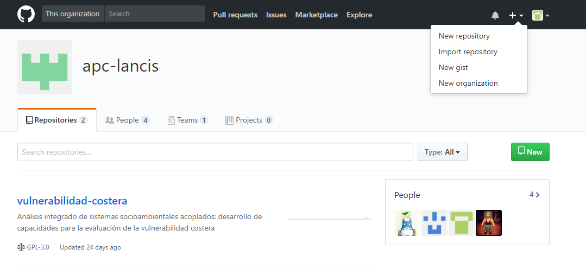

# Manual para generar páginas web en GitHub

En proyectos del Área de Planeación Colaborativa (APC) con colaboración de externos se requiere contar con una página web donde se compartan documentos necesarios para el buen desarrollo del proyecto, como procedimientos, protocolos, manuales y reglamentos. En este manual se explica la forma de generar páginas web por parte de cualquiera de los colaboradores de APC.

## Software necesario

* Cuenta en GitHub
* GitHub desktop (opcional)

## Requisitos previos

1. El repositorio de GitHub donde se creará la página debe ser parte de una cuenta de organización
2. Tener un índice del contenido de la página en formato markdown (md) que se convertirá en el README de la página. En caso de no tenerlo se puede hacer al momento de crear la página desde GitHub

## Procedimiento

* Generar un nuevo repositorio.
  1. Dar click en el botón de "+", "New repository". O hacer click [aquí](https://github.com/new).

 
**Figura 1.** Crear repositorio.

  2. Llenar la página que se abre con el nombre del repositorio, la descripción (opcional), "public" activado, inicializar el repositorio con un README, y agregar la licencia "GNU General Public Licensev 3.0".
  3. Dar click a crear repositorio ("create repository")
  4. Describir el contenido del repositorio en la página del repositorio en el botón "Edit"

* Hacer el README
  1. Abrir el archivo README.md
  2. Dar click al botón del lapiz ("Edit this file")
  3. Copiar o escribir el índice del contenido de la página web en formato markdown
  4. Comentar los cambios (Commit changes) con un breve título. La descripción es opcional
  5. Dar click en el botón "commit changes".

* Crear la carpeta docs
  1. Click en "create new file"
  2. Nombrar el archivo nuevo "docs/README.md"
  3. Escribir título y contenidos concisos, en minúsculas y sin ningún símbolo
  4. Crear una subcarpeta si el documento contiene imágenes. En esta subcarpeta se guardará el archivo del documento y todos los archivos de las imágenes que contenga.

* Generar la página web

Para referencia consultar [la guía](https://pages.github.com/)

  1. Dar click en "Settings"
  2. Ir a la sección de "GitHub Pages"
  3. Seleccionar en "Source" la opción "master branch/docs folder"
  4. Seleccionar en "Theme Choser" la apariencia de la página. Se despliegan varias opciones y a la que se le elija se oprime el botón "select theme" y el README de la página tendrá ahora el formato elegido automáticamente.
  5. Copiar la dirección de la página web y pegarla en la página del repositorio en el botón "Edit"
  6. Copiar la dirección de GitHub de los archivos guardados en la carpeta "docs" y vincularlos en donde correspondan en el README para que se desplieguen al abrir la página web.

* Actualizar la página web

Por cada actualización que se realice se deberá registrar la fecha de cambio en la página web.

  1. Modificar el README de la página con las actualizaciones de la misma manera que se hizo al generarlo
  2. Subir los archivos nuevos de los documentos, si es el caso, al repositorio y guardarlos en la carpeta "docs"
  3. Vincular la dirección de los documentos nuevos en el README 
  4. Hacer este procedimiento por cada archivo nuevo o corregido que se suba. No se debe hacer un solo procedimiento por varios archivos porque no se hacen los cambios en la página web.
