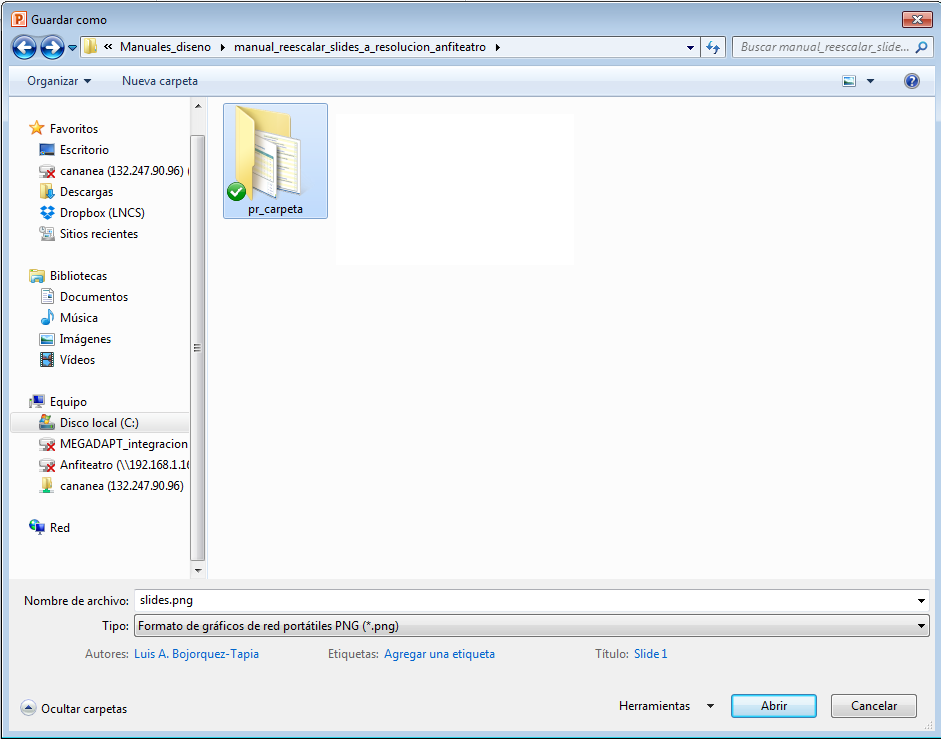

# Manual para ajustar el tamaño de slides generadas en PowerPoint a la resolución del Anfiteatro

Las pantallas del Anfiteatro de Decisiones de LANCIS tienen una resolución de 1920 × 1080 pixeles (Full HD), este es el tamaño final que deben tener todas las _slides_ que se proyecten en ellas. Este manual explica los pasos a seguir para, a partir de _slides_ generadas en PowerPoint, ajustar a la resolución requerida.

## Software necesario

* PowerPoint versión 2010 o posterior
* Photoshop CS6
* FileRenamer 8

## Modificar la resolución de exportación de PowerPoint
Dado que la mayoría de las presentaciones que generamos se preparan primero en PowerPoint para luego exportar cada slide como PNG, es necesario modificar las preferencias del programa pues la resolución a la que normalmente exporta imágenes no nos será suficiente. Para lograr que PowerPoint alcance una resolución de exportación de 300 ppi, debemos seguir cuidadosamente <a href="https://support.microsoft.com/en-us/help/827745/how-to-change-the-export-resolution-of-a-powerpoint-slide/" target="_blank">estas instrucciones</a>. Opcionalmente podemos seguir las <a href="https://support.microsoft.com/es-es/help/827745/how-to-change-the-export-resolution-of-a-powerpoint-slide/" target="_blank">mismas instrucciones en español</a> (aunque advertimos que se trata de una traducción automática). El procedimiento debe seguirse con mucho cuidado ya que un error al modificar registros de un programa puede dejarlo inoperante.

## Exportar desde PowerPoint
  * Una vez cambiadas las preferencias de PowerPoint podemos exportar las _slides_ como PNG: Ir al menú  `Archivo / Guardar como...`. En el tipo de archivo seleccionar `PNG`. Como veremos más adelante, no importa mucho el nombre que elijamos en el campo del nombre de archivo.

 
**Figura 1.** Guardar como PNG.

  * Luego de seleccionar el lugar donde se crearán los PNG y teclear OK,  el programa nos preguntará si queremos exportar sólo la diapositiva actual o si queremos exportar "cada diapositiva". En este caso, si nuestra presentación está terminada, seleccionamos `Cada diapositiva`.

   
  **Figura 2.** Seleccionar qué diapositivas se exportan.

  * Después que termine de exportar, observamos que PowerPoint ha creado una subcarpeta (con el nombre que ingresamos en el campo del nombre del archivo). En ella tendremos una serie de archivos PNG numerados y precedidos por la palabra _Diapositiva_ o _Slide_ (según nuestra versión del programa). Más adelante cambiaremos este prefijo con FileRenamer.
  * Otra cosa a notar es que las imágenes, al haber sido exportadas a la máxima resolución, tienen un tamaño de 3000 × 1687 pixeles (siempre que hayamos usado la plantilla adecuada). Esto es mucho más de lo que necesitamos, sin embargo  es preferible, pues al reducir mantendremos la mejor calidad de imagen. El siguiente paso será entonces, reducir las imágenes en Photoshop.

## Ajustar tamaño de slides en Photoshop

* Abrir Photoshop y cargar el set de acciones `acciones_photoshop_presentaciones.atn` o asegurarnos de tenerlo cargado previamente. 
  * Si no tenemos a la vista la paleta de acciones, ir al menú `Window / Actions`).
  * En el menú de la paleta, seleccionar `Load Actions...` y seleccionar nuestro set de acciones ubicado en `ORGANIZACION_APC\apc_acciones_photoshop`.

 
**Figura 3.** Cargar acciones.

 
**Figura 4.** Acciones cargadas.

* Una vez cargadas las acciones, correremos la acción `1920_px_de_ancho` en un lote de imágenes mediante _Batch._ Ir al menú `File / Automate / Batch... `

 
**Figura 3.** Parámetros en Batch.

* Siguiendo el orden de la ventana _Batch_ indicaremos:
    * A qué _set_ de acciones pertenece la acción a aplicar: `acciones_photoshop_presentaciones`
    * El nombre de la acción: `1920_px_de_ancho`
    * La carpeta de origen _(Source Folder)_ con el lote de imágenes que queremos modificar
    * El destino que en este caso será "Save and Close" para que las imagenes modificadas sustituyan a las originales.
    * Tecleamos OK y vemos correr la acción en nuestro lote de imágenes.

## Renombrar
Sólo nos queda sustituir la palabra "Diapositiva", por el prefijo `sl_`. Utilizamos la función `Replace/Remove` del programa **FileRenamer**.
