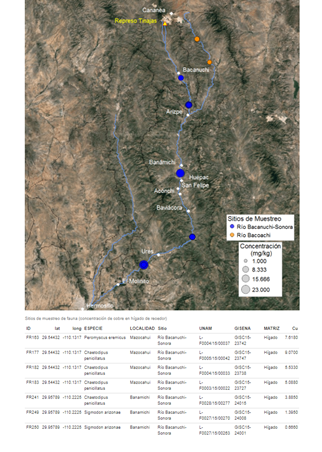

# Protocolo de generación de gráficas y mapas con salida en HTML

* * *

## Objetivo y alcance

**Objetivo:** Estandarizar la elaboración de mapas y gráficas en la realización de los proyectos del Área de Planeación Colaborativa (APC), así como la información relacionada con los servicios ejecutados.

**Alcance:** Aplica para los proyectos desarrollados por el APC.

* * *

## Protocolo

El desarrollo y gestión de la información representada en los mapas y gráficas es la base para los estudios realizados por el APC, por lo tanto, se vuelve fundamental y prioritario seguir un orden en su creación y resguardo de información.

Para dar salida, respaldo y acceso a las gráficas y mapas, el script debe ser hecho en Markdown (Md) como una herramienta que permite la conversión de texto plano a un HTML de forma muy sencilla, ver:

```
http://rmarkdown.rstudio.com/lesson-1.html
```

* * *

## Materiales, equipos y reactivos

No aplica.

* * *

## Actividades y responsables

El jefe del Área asigna a un responsable para generar la gráfica y/o mapa.

Para generar una gráfica y/o un mapa en el lenguaje de R se tiene que contar con las bases de datos en formato de csv y éstas deben de tener sus respectivos metadatos ver, [Protocolo de recepción y entrega de activos de información](lancis_fed_pcr.html).

### Requisitos para recibir base de datos

*	Llenar el formulario de entrega de datos, ver [Formulario para reportar la entrega de activos de información](https://goo.gl/forms/cTrYr1Yo0BahmYc63); y revisar el [Protocolo para el manejo de bases de datos](protocolo_manejo_bd.html) para conocer los estándares generales con los que deben cumplir las bases de datos.

### Nombre de las gráficas y Md:

Estos archivos deben ser nombrados de la siguiente forma:

gr_nombre_proyecto_fecha

Donde:

gr= prefijo de gráfica

nombre= tema o título que indique el contenido de la gráfica

proyecto= nombre del proyecto de donde proceden los datos

fecha= día, mes y año de cuando se envía esa versión de los datos

En caso de tratarse de un pre procesamiento de datos, cuyo fin no es el de obtener una gráfica o un mapa, debe de indicarse en el nombre del Md de la siguiente forma:

pre_analisis_nombre del tema o archivo que se trabaja_fecha

### Información mínima necesaria contenida en los Md

Los Md deben de tener la siguiente información:

* Información correspondiente a la cadena de custodia de los datos (ver `plantilla_md`)

  * __Proyecto,__ nombre del proyecto
  * __Entrega,__ es la información del colaborador que está entregando activos de información
  * __Recepción,__ es la información del colaborador que se encarga de recibir los activos de información
  * __Título,__ es el título de la información que se está representando en las gráficas y/o mapas
  * __Tema,__ en algunos proyectos están divididos en temas, ejemplos: peces, fauna terrestre, microbiota, vegetación, abiótico, geomorfología
  * __Fecha de toma de muestras,__ se coloca la fecha de la toma de las muestra
  * __Fecha de Vo.Bo.,__ es la fecha en la que el responsable de la información revisó y aprobó las gráficas y/o mapas
  * __Metodología,__ es la descripción del proceso para la obtención de los datos
  * __R (versión) Rstudio (versión),__ es importante especificar la versión de los lenguajes de programación en el que fueron ejecutados los datos


**Nota:** Para dar formato al texto, en Markdown se utilizan signos de puntuación y caracteres básicos; se recomienda consultar los siguientes enlaces para conocer cómo operan:
```
http://rmarkdown.rstudio.com/authoring_basics.html
```
```
https://www.rstudio.com/wp-content/uploads/2015/03/rmarkdown-reference.pdf

```

El orden de los comandos recomendado para realizar un Md es el siguiente:

* Libraries (se contará con un repositorio para facilitar el uso de las mismas)
*	Data.frame
*	Objets <-


*	Geoms
* Scales
*	Labs
*	Theme


En caso de que la gráfica haya sido editada en algún otro programa (Photoshop, Ilustrator, etc.) para efectos de presentación, esto deberá ser mencionado como nota en el md y se agregará la versión final de la gráfica con el siguiente comando fuera del chunk:

```
![Caption for the picture.] (Z:\Procesamiento\Graficas\faseaguda\superficial_muestreo\G_SOL_M_Al31.png)
```

En caso de que la base de datos se haya agregado desde un csv, la tabla de datos se agrega al final del markdown (dentro de un chunk) con el siguiente comando:

```
{r,echo=FALSE}
knitr::kable(laTablaAl)
```

Dentro del paréntesis va a el nombre de la base de datos correspondiente.

En caso de que la base de datos sea muy grande, se podrá agregar sólo parte de ella.

Ejemplo:




* * *

## Referencias


http://rmarkdown.rstudio.com/authoring_basics.html

http://www.analiticaweb.es/agilidad-facilidad-markdown/

http://rmarkdown.rstudio.com/lesson-1.html

* * *
