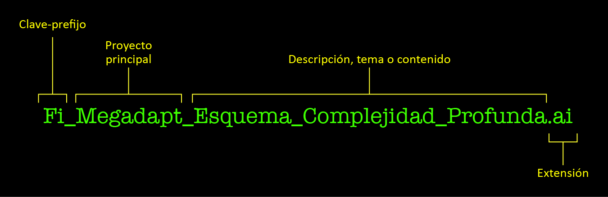
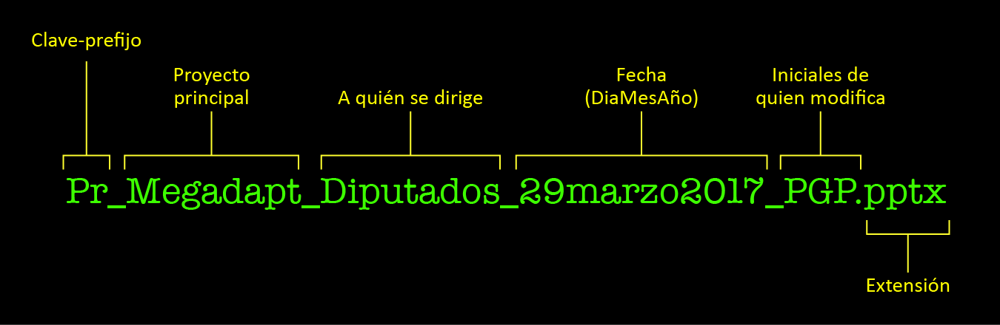

# Protocolo de organización de activos de información
* * *

## Objetivo y alcance

**Objetivo:** Organizar y respaldar la información de todas las actividades y los proyectos desarrollados por el Área de Planeación Colaborativa (APC).

**Alcance:** Aplica para los activos de información de entrada y salida de los proyectos desarrollados por el APC.

* * *
## Protocolo

La organización y el resguardo de la información generada en el Área es la base para el buen desarrollo de los proyectos en APC. A continuación se describe la forma de organizar los activos de información de los siguientes rubros:

* Proyectos
* Presentaciones
* Informes
* Propuestas
* Clases de posgrado
* Respaldo en discos duros externos

* * *
## Materiales, equipos y reactivos

Equipo de cómputo y programa de DropBox instalado en el disco duro de la computadora (C).

* * *
## Actividades y responsables

#### Responsable de organización de activos de información

El coordinador asignará a una persona como responsable de la creación y organización de las carpetas pertinentes, de acuerdo al tipo de activo de información que resguarde.

Sus actividades serán:

* Crear las carpetas adecuadas para el procesamiento del activo de información que le corresponda en el Dropbox
  _(ver el apartado: Estructura de las carpetas)_.
* Mandar un correo informativo con la ubicación de las carpetas.
* Monitorear a los colaboradores dando seguimiento a la organización y nombramiento de los archivos.
* Crear un archivo `README.txt` en la raíz de la carpeta con la descripción del contenido. Este archivo debe ser actualizado cada que se modifique contenido importante en las carpetas
En la carpeta de plantillas (`ORGANIZACION_APC\apc_plantillas`) se ubica una plantilla de muestra para el archivo README
* Respaldar los activos cada semana

#### Sobre el archivo README.txt

La plantilla proporcionada para este archivo es solo una muestra de un caso típico (ver `ORGANIZACION_APC\apc_plantillas\plantilla_de_archivos_README.txt`). El responsable puede modificarla haciéndolo más o menos detallado, según sea el caso, pero siempre considerando que la función de este archivo es ser útil a quien consulte el contenido de la carpeta y busque algo en ella. Lo que consideramos importante sobre este archivo es:

1. Que el archivo exista en la raíz de la carpeta principal.
2. Que se revise y actualice con regularidad (obligadamente al concluir el proyecto).
3. Que sea claro para quien lo consulte.

Asimismo, también es factible crear archivos README para subcarpetas dentro del proyecto, especialmente cuando se creen carpetas especiales no contempladas en el flujo normal de trabajo.

#### Nombre de las carpetas y archivos de cualquier activo de información

El nombre de los archivos no debe llevar espacios, ni acentos, ni caracteres especiales restringidos:

 `# % & \ / { } < > * ? " ' : @ | +`

En lugar de espacios se usarán guiones bajos entre palabras.

Asímismo el nombre del archivo deberá incorporar en el siguiente orden:

1. Clave o prefijo
2. Nombre del proyecto principal
3. Descripción, tema o contenido

 Para archivos con versiones en revisión deberán incluirse además:

4. Fecha
5. Iniciales de quien modifica la versión.

Como muestra, véase el siguiente ejemplo:


**Figura 1.** Ejemplo de nombre de archivo.

Suele ser frecuente en presentaciones el caso de archivos en revisión de los cuales se generan múltiples versiones del PPT. En el siguiente ejemplo vemos cómo en lugar de descripción se incorpora el destinatario de la presentación además de la fecha y el responsable de la versión.


**Figura 2.** Ejemplo de nombre de archivo de presentación con múltiples versiones.

#### 1) Clave o prefijo

Se utilizarán dos letras como prefijo para indicar el tipo de producto del que se trate.

Los tipos de archivos y sus prefijos se enlistan en la siguiente tabla:

**Tabla 1.** Claves y tipos de productos.

| Tipo de producto    | Prefijo |
| ---                 | :---:  |
| Base de datos       | bd_    |
| Figura              | fi_    |
| Foto                | fo_    |
| Gráfica             | gr_    |
| Mapa                | ma_    |
| Presentación        | pr_    |
| Slide               | sl_    |
| Video               | vi_    |
| Título              | ti_    |
| Leyenda             | le_    |
| GIF                 | gif_   |
| Miniatura           | mini_  |
| Logotipo            | logo_  |

Para casos no contemplados en la tabla, se propone escribir el tipo de producto en el nombre del archivo, así, un informe, una ficha, o un manual, comenzarán con la palabra, `informe_`, `ficha_` o `manual_`, respectivamente.

#### Nota acerca de las extensiones de los archivos

En algunos casos el requerimiento del prefijo puede parecer ocioso, más si consideramos que las extensiones de los archivos suelen revelar el tipo de contenido de los mismos (por ejemplo, un archivo `mp4`, forzosamente es un video), sin embargo, el uso del prefijo resulta útil para la programación de la presentación.

**Puede ser solo por tipos de archivos y los programas que los leen o generan:**

| Extensión | Descripción |
| --- | --- |
| AI  | Adobe Illustrator |
| xls  | Excel |
| psd  | Photoshop |
| etc | etc |

**o bien, un listado de extensiones y una descripción o al menos especificar qué tipo de archivo es:**

| Tipo de producto | Extensiones | Software |
| ---          | ---      | :---: |
| Bases de datos | xls, acc, csv, etc | Excel, Acces |
| Imágenes en mapa de bits |  png, jpg, jpeg, tif | Photoshop |
| Gráficas | rmd, r | R, Illustrator |
| Imágenes vectoriales | ai, pdf | Illustrator, Acrobat |

#### 2) Proyecto principal

Teniendo en cuenta que un archivo puede pertenecer a más de un proyecto, especificar cuál es el proyecto principal con que está relacionado. Se puede omitir este requerimiento cuando el producto sea de uso general, es decir, se utilice en varios productos de LANCIS y no pertenezca realmente a un proyecto específico.

#### 3) Descripción

Se espera una descripción clara y lo más concisa posible del contenido del mismo. Se recomienda eliminar artículos entre palabras y se sugiere recurrir a palabras clave _(tags)_ que permitan encontrar fácilmente el archivo mediante búsquedas.

Como parte de la descripción se pueden especificar subcategorías cuando se considere necesario, por ejemplo, cuando se trate de un Esquema o de un Timeline, etc.

 _Ejemplo:_ `Fi_Megadapt_Esquema_Resiliencia.png`.

 Es importante evitar ambigüedades y ser tanto demasiado genérico como demasiado espacífico. Así, evitaremos llamar a algo `Base_de_datos.xls` o bien `Bd_Base_de_datos_encharcamientos_por_delegaciones_para_mes_de_mayo.csv`.

En el caso de presentaciones, la descripción del contenido viene dada por el destinatario (a quién se presenta) y la fecha de presentación, o bien, si se trata de versiones (ediciones) del mismo archivo, la fecha de la versión y las iniciales de quien modifica (véase Figura 2).

_Ejemplo:_ `Pr_Megadapt_Presentacion_Espejo_Yucatan_29marzo2017.png`.

#### Versiones de archivos

El uso de DropBox nos asegura un respaldo en línea y un historial de versiones, por lo que en principio no es necesario conservar múltiples versiones de ningún archivo; sin embargo, hay casos en los que sí se considera justificado hacerlo saber:

* Presentaciones con múltiples ediciones de diferentes colaboradores. Como se muestra en la Figura 2 y en el apartado  **Descripción,** es una forma común de trabajo que se conserven las modificaciones específicas por fecha y por colaborador.
* Productos adaptados a distintos formatos, por ejemplo:
 - Presentaciones que se conservan en proporción 4:3 y 16:9.
 - Figuras modificadas para algún fin específico. _Ejemplos:_ alguna figura en su versión a color y versión en escala de grises, o versión para PowerPoint y versión para publicación impresa, o versiones simplificadas, etc.
* Figuras o productos complejos que durante su planeación puedan requerir hacer múltiples variantes para su perfeccionamiento y discusión, en estos casos se suele poner al final del archivo, v1, v2, etc.

Lo recomendable es no llenarnos de versiones innecesarias y hacer una depuración al final del proceso eliminando las versiones que consideremos prescindibles. Dejamos este punto a buen criterio de quien genere el producto en cuestión.

**Nota:** Para mayor información sobre el historial de versiones de Dropbox [revisar este link.](https://www.dropbox.com/help/security/version-history-overview)

* * *
### Proyectos

Cada nuevo proyecto quedará registrado por el responsable de activos de información en la hoja de cálculo del google drive `Organización_General`.

El nombre de la carpeta del nuevo proyecto tiene que ser corto y que este nombre les indique a los colaboradores de qué proyecto se trata.
La carpeta del nuevo proyecto se crea a nivel de raíz del Dropbox y va en mayúsculas, como se muestra a continuación

```
DropBox (LNCS)\
└── IAI\
└── MEGADAPT\
└── OIPA\
└── PACIFICO\
└── PAPIIT\

```
#### Estructura de las carpetas o directorios

El nombre de las carpetas tiene que ser corto:

* Las carpetas que se encuentra en el nivel inferior a la carpeta principal del proyecto, tienen que tener como prefijo el nombre corto del proyecto, ejemplo: `mega_insumos`, así como se muestra la siguiente sección

Como ya se mencionó, es labor del responsable de los activos de información crear la carpeta y subcarpetas necesarias para el proyecto. Quien realice la coordinación tiene que decidir la estructura más conveniente de subcarpetas, como mínimo debe de contener las siguientes subcarpetas:

 ```
 DropBox (LNCS)\
 └── MEGADAPT\
     └── mega_insumos\
         ├── mes_año\
     └── mega_procesamiento\
         ├── banco_datos\
         ├── codigos\
         ├── figuras\
         ├── graficas\
     └── README.txt
 ```

 En donde:

 * __proyecto_insumos:__ Insumos recibidos que servirán para el proyecto.
 * __proyecto_procesamiento:__ Se crearán aquí tantas carpetas como se considere necesario. Idealmente no deben ser demasiadas para permitir operar adecuadamente. Algunas posibles subcarpetas que vale la pena comentar son:
    - __banco_datos:__ Son bases de datos, generalmente `csv`. También pueden ser bancos de datos contenidos en una capa geográfica de tipo vectorial.
    - __codigos:__ Son códigos de programación.
    - __figuras:__ Imágenes generalmente en formato `png`.
    - __graficas:__ Markdown para generar gráficas y las imágenes de las gráficas en formato `png`.
 * __README.txt__ Archivo de texto creado y actualizado por el responsable de la presentación con la descripción del contenido y organización de la carpeta.

* * *
### Presentaciones

En el Área de Planeación Colaborativa realizamos al menos dos tipos de presentaciones:

1. Presentaciones ordinarias en Powerpoint para uso interno o externo.
2. Presentaciones especiales preparadas expresamente para el Anfiteatro de Decisiones.

#### Creación de la presentación inicial mediante plantilla
Todas las presentaciones toman como punto de partida la plantilla oficial de presentaciones LANCIS, ubicada en nuestra carpeta de Dropbox en la siguiente ruta:

```
ORGANIZACION_APC\plantillas\plantillas_presentaciones
```

Esta plantilla está preparada para pantallas _widescreen,_ con relación de aspecto 16:9.

#### Tipos de presentaciones

#### Presentaciones ordinarias
Las presentaciones ordinarias (aquellas que no se utilizan en el Anfiteatro de Decisiones) constan básicamente de un solo archivo PPT donde se vierte el contenido correspondiente, dentro de su carpeta, puede conservarse también otro tipo de contenido (figuras, gráficas, fotos, mapas, etc.) generado o modificado expresamente para dicha presentación.

#### Presentaciones para Anfiteatro
Las presentaciones preparadas para el Anfiteatro suelen tener mayor complejidad en cuanto a la cantidad de insumos y productos que hay que procesar y generar. En su forma final, una presentación para el Anfiteatro consta de:

* _Slides._ Archivos PNG exportados desde PowerPoint (o algún otro programa) en la resolución y proporciones de las pantallas del Anfiteatro.
* Archivos HTML para conectarse a un servidor.
* Un archivo de texto que sirve de guión, en donde se establece la secuencia de cada _slide,_ HTML o algún otro elemento que deba cargarse en las pantallas.

Como parte del procedimiento, utilizamos la ya mencionada plantilla de Powerpoint (`plantilla_presentaciones_16-9.pptx`) para generar un archivo maestro en el que se organiza el contenido de la presentación. Posteriormente, este archivo es utilizado para exportar las _slides_ y generar los PNG finales (para conocer la manera correcta de exportar _slides_ véase el apartado **Apéndices** que remite a los manuales correspondientes).

Otra parte importante en el procedimiento es el desarrollo del guión, para lo cual se utiliza el archivo `plantilla_guion_presentaciones_anfiteatro.potx` incorporando en este documento las imágenes generadas a partir de las slides. El archivo mencionado se encuentra también en:

```
ORGANIZACION_APC\plantillas\plantillas_presentaciones
```
#### Organización de carpetas

Como ya mencionamos, las presentaciones más sencillas pueden consistir únicamente de un archivo PPT (y su versión en PDF) y no requerir ningún insumo adicional. Por otra parte, las presentaciones más complejas requieren que  los insumos (gráficas, tablas, figuras, esquemas, videos, etc.) se conserven en la misma carpeta del PPT para futuras revisiones. Este punto se describe con mayor detalle en el apartado [Estructura de las carpetas o directorios.](#Estructura de las carpetas o directorios)

El responsable de activos de información creará una carpeta de cada presentación en `Dropbox (LANCIS)/PRESENTACIONES`. Igual que los archivos, estas deberán identificarse con los siguientes elementos:

* Nombre del proyecto principal (en caso de haberlo).
* Nombre del destinatario (a quién va dirigido o a quién se presentará). _Ejemplo:_ Rectoría, Diputados, Semarnat, etc.
* Fecha (díaMesAño).

Así, un nombre típico de carpeta o directorio sería: `pr_megadapt_diputados_29mar2017`

#### Estructura de carpetas en presentaciones ordinarias
En el caso de presentaciones sencillas una posibilidad es agrupar como en el siguiente ejemplo:

```
DropBox (LANCIS)\
└── PRESENTACIONES\
    └── pr_megadapt_mensual_ago2017\
        ├── procesamiento\
        │   ├── gif_crecimiento_urbano\
        │   ├── gr_megadapt_crecimiento_urbano\
        │   ├── fi_megadapt_tabla_ecuacion.ai
        │   ├── fi_megadapt_tabla_ecuacion.png
        |   ├── logo_netlogo.png
        │   └── logo_qgis_2017.png
        ├── pr_megadapt_mensual_agosto2017.pptx
        ├── pr_megadapt_mensual_agosto2017.pdf
        └── README.txt
```

Nótese que todos los insumos creados o utilizados para la presentación están en la carpeta de `procesamiento`, de hecho, en este caso también podría llamarse simplemente `insumos`. En la raíz de la carpeta queda únicamente el PPT y el PDF final y el README.

Puede haber casos que requieran alguna carpeta especial no contemplada en esta estructura, se deja la decisión en manos del coordinador responsable de la carpeta.

#### Estructura de carpetas para presentaciones del Anfiteatro
En el caso de presentaciones para el Anfiteatro de Decisiones la estructura propuesta es la siguiente:

```
DropBox (LNCS)\
└── PRESENTACIONES\
    └── pr_proyecto_destinatario_fecha\
        ├── carpetas_de_trabajo\
        |   ├── colaborador_1\
        |   ├── colaborador_2\
        │   └── colaborador_2\
        ├── insumos_y_auxiliares\
        ├── logistica\
        ├── plataforma\
        |   ├── guion_nombre.txt
        |   ├── slides\
        |   ├── gif_crecimiento_urbano.gif
        |   ├── le_nombre_leyenda.png
        |   ├── ti_nombre_titulo.png
        │   └── etc...
        ├── procesamiento\
        |   ├── figuras\
        |   ├── fotos_videos\
        |   ├── graficas\
        |   ├── mapas\
        |   |   └── sig
        |   ├── plantillas_estilos_colores\
        |   ├── screenshots\
        |   ├── slides\
        |   |   ├── sl_01.png
        |   |   ├── sl_02.png
        |   |   ├── sl_03.png
        |   |   └── etc...
        │   └── titulos_leyendas\
        ├── pr_proyecto_destinatario_fecha.pdf
        ├── pr_proyecto_destinatario_fecha.pptx
        └── README.txt
```

En donde:

* __carpetas_de_trabajo:__ En ella los colaboradores podrán guardar temporalmente material de trabajo.
* __insumos_y_auxiliares:__ Insumos recibidos para la presentación y archivos auxiliares que servirán de referencia que pueden o no terminar formando parte de la presentación una vez procesados.
* __logística:__ Listas de asistencia, minutas, membretes, carátulas de CD, etc. Todo lo relacionado con la organización el día de la presentación.
* __plataforma:__ Insumos finales que se cargan a la plataforma del Anfiteatro, es decir, el guión y los PNG finales de todo aquello que se haya incorporado a la presentación en su forma final:
  * guion txt que es el código necesario para operar la presentación en la plataforma.
  * guion PPT
  * slides finales en PNG para las pantallas en tamaño HD (1080 por 1920 pixeles).
  * contenido extra incorporado directamente a la presentación (gif, videos, leyedas, etc.)
  * Temporal: Carpeta de trabajo en donde se alojarán pruebas y productos temporales. Al terminar el proceso de creación de la presentación esta carpeta deberá quedar vacía, pues su contenido deberá depurarse copiando los archivos finales a la la carpeta correspondiente de procesamiento en Dropbox y eliminar lo que ya no sea relevante o no se haya ocupado en la versión final.
* __procesamiento:__ Se crearán aquí tantas carpetas como se considere necesario. Idealmente no deben ser demasiadas para permitir operar adecuadamente. Algunas posibles subcarpetas que vale la pena comentar son:
   - __fotos_videos:__ Imágenes en mapa de bits, generalmente `png`, pero pueden ser `jpg` o `tif`. Para animaciones y video `gif` y `mp4`.
   - __mapas:__ Mapas en `mxd`, `qgis`, y versiones en `png`. Aquí se pueden guardar también las capas del SIG utilizadas.
   - __plantillas_estilos_colores:__ Para plantillas de todo tipo (de QGIS, de PPT, Word, Illustrator, etc.), así como paletas de colores y estilos de mapas, acciones de Photoshop, etc.
   - __screenshots:__ Cuando en una presentación en el Anfiteatro se integren interfaces de mapas o de software, deberán hacerse capturas de pantalla _(screenshots)_ para posteriormente integrarse al PowerPoint final. Guardar las capturas en esta carpeta, registrando el lugar que deben ocupar en la presentación final.
   - __slides:__ Carpeta en la que se generan los slides para las pantallas. De aquí se tomarán los _slides_ que deben integrarse a la plataforma.
   - __títulos_leyendas:__ Títulos de gráficas, leyendas para mapas.
<br>
* __PowerPoint__ y __PDF__ con la versión maestra o final de la presentación. De preferencia debe estar completo y en el orden que se utilizará en el anfiteatro. A través del PPT se generan las slides finales para la plataforma. Una vez ocurrida la presentación deben integrarse al PPT los _screenshots_ de las interfaces que se hayan operado. El PDF es importante como respaldo y se genera a partir del PowerPoint final.
* __README.txt__ Archivo de texto creado y actualizado por el responsable de la presentación con la descripción del contenido y organización de la carpeta.

#### Actividades posteriores al término de la presentación

Una vez que haya ocurrido la presentación es de suma importancia hacer una revisión del contenido de la carpeta `plataforma` y revisar que todos los insumos utilizados estén en la raíz de esta carpeta. De no ser el caso, se procederá a incorporarlos y modificar las rutas correspondientes en el guión final.

Asímismo, se debe actualizar el archivo PPTX con la versión final presentada y se incorporarán en ellos los screenshots de las pantallas que hayan operado a través de páginas web o alguna interfaz particular. Se debe generar también un PDF final a partir del archivo de PowerPoint.

#### Apéndices: Manuales de apoyo

* Manual para exportar _slides_ a resolución y formato HD: `manual_reescalar_slides_a_resolucion_anfiteatro.html` ubicado en

 ```
 Dropbox (LANCIS)\ORGANIZACION_APC\iso\manuales\manual_reescalar_slides_a_resolucion_anfiteatro
 ```

 Este documento describe cómo modificar la resolución de exportación desde Powerpoint y posteriormente reescalar los PNG exportados a la resolución correcta para las pantallas.

* * *
### Propuestas

Todas las propuestas hechas por APC para la obtención de proyectos se respaldarán en `Dropbox (LANCIS)ADMIN`. Dentro de esta carpeta general hay una carpeta `admin_propuestas` en las que se crearán subcarpetas con el nombre de la institución convocante o a la institución a la que se le entrega la propuesta (ejem. CONACYT, PAPIIT, SEMARNAT, INE, etc.).

#### Estructura de carpetas

El coordinador responsable de la propuesta o la persona responsable de la gestión de la información de la propuesta generará la siguiente estructura de carpetas dentro de la subcarpeta con el nombre de la institución. La estructura de carpetas, como ya se ha mencionado anteriormente, es flexible a las necesidades de la propuesta, por lo que no es necesario que se generen todas las subcarpetas propuestas. Sin embargo,si es necesario crear otra subcarpeta diferente a las ya establecidas se debe notificar al responsable de activos de información para que esté enterado.

```
DropBox (LANCIS)\
└── ADMIN\
    └── admin_propuestas\
        ├── conacyt\
        │   ├── consolidacion_ln_2018\
        │    │   ├── auxiliares\
        │    │   ├── insumos\
        │    │   │   ├── convocatoria\
        │    |   ├── info_adicional
        │    │   └── notificaciones
        └── README.txt
```
En donde:

* **auxiliares:** Archivos viejos, plantillas y archivos que no formaron parte de la propuesta final.
* **insumos:** Información que alimentó la entrega final. En esta subcarpeta habrá otra subcarpeta llamada **convocatoria**, donde se pondrá toda la información referente a ésta.
* **entrega_final:** Todos los documentos que conformaron la propuesta y se entregaron a la dependencia correspondiente.
* **info_adicional:** Información adicional que se solicitó posterior a la entrega final.
* **notificaciones:** Correos electrónicos, oficios y demás documentos donde se solicite la información adicional.

* * *
### Clases de posgrado

La organización de clases de posgrado que se generan en APC se refiere a toda la información utilizada y generada en los diferentes cursos de posgrado impartidas por los integrantes del Área.

El profesor responsable del curso designará al responsable de la gestión de la información que se genere o requiera para su curso. Por lo tanto, este responsable será el encargado de solicitar y recopilar toda la información utilizada para impartir la materia.

#### Estructura de carpetas

El responsable generará una carpeta general con el nombre de la materia en la carpeta POSGRADO anteponiendo la abreviatura porgra_ en el Dropbox (Ejem. posgra_herramientas_analiticas_enlcs).
Dentro de esta carpeta general se creará la siguiente estructura de carpetas:

```
DropBox (LANCIS)\
└── POSGRADO\
    └── posgra_herramientas_analiticas_enlcs\
        ├── 2016-1\
        |   ├── generales\
        |   ├── entregas\
        ├── auxiliares\
        ├── ejercicios\
        ├── literatura\
        |   ├── articulos
        ├── presentaciones\
        └── README.txt
```

En donde:

* Numeración del semestre que le corresponda, ejem. **2016-1:** Dentro de esta carpeta se pondrán dos subcarpetas:    **generales**   y  **entregas**.  En la subcarpeta de “generales” se colocarán los documentos administrativos del curso: syllabus, listas de alumnos, calificaciones, calendarios y exámenes. En la subcarpeta de “entregas” se colocarán los ejercicios y los trabajos entregados por los alumnos. En caso de que el curso sea optativo, solo se pondrán las subcarpetas generales y entregas como carpetas principales, sin que se ponga una carpeta con la numeración del semestre.  
* **auxiliares:** En esta carpeta se colocarán los archivos con versiones viejas y archivos con material de apoyo para dinámicas dentro de los cursos.     
* **ejercicios:** En esta carpeta se colocarán los ejercicios de trabajo.   |
* **literatura:** En esta carpeta se pondrá una subcarpeta para los artículos del curso llamada **“artículos”** y los capítulos de los libros utilizados. Los libros completos se pondrán temporalmente. Los archivos de los libros completos permanecerán en la carpeta **BIBLIO** del Dropbox.   
* **presentaciones:** En esta carpeta se pondrá una subcarpeta de **versiones viejas** en el caso que el curso sea repetitivo. Las presentaciones del curso se nombrarán de acuerdo con lo descrito anteriormente en la sección de `Presentaciones`.

En caso de que la materia no sea obligatoria y se repita cada año, la carpeta general deberá contener al menos las subcarpetas generales, ejercicios y presentaciones.

* * *
### Respaldo en discos duros externos

Toda información de un proyecto activo debe quedar respaldada en el DropBox, y semanalmente hacer respaldo en un disco duro externo que se haya designado previamente.

#### Responsables de hacer respaldos de activos de información

* Responsable de la gestión de activos de información de Proyectos
* Responsable de la gestión de activos de información de carpetas del Dropbox que no sean proyectos
* Responsable de la administración de APC
* Técnicos por proyectos
* Estudiantes

#### Asignación de discos duros externos

Los responsables de la gestión de activos de información asignarán cuatro proyectos o carpetas de Dropbox por cada disco. El disco duro debe contener una carpeta general con el nombre del proyecto y o carpeta donde se guardará la información.

El responsable de administración tendrá un disco exclusivo para resguardo de la información administrativa generada en todos los años de existencia de APC.

Los técnicos por proyecto y estudiantes tendrán un disco duro asignado para resguardo de sus carpetas de trabajo.

#### Actividades para resguardar activos de información

* Etiquetar los discos con la fecha de inicio de uso y su contenido (nombre de proyectos o carpetas)
* Respaldar los activos de información en la carpeta establecida previamente para tal propósito
* Hacer  y actualizar un README del contenido del disco que están usando y actualizando periódicamente.
* Revisar la fecha de inicio de uso de los discos. Si tienen más de cinco años de uso, duplicar la información en otro disco externo.
* Verificar que la información de proyectos antiguos estén en el DropBox. Si no lo están, hacer dos redundancias en discos duros externos. Si está solo se hace una réplica en disco. Esto sólo aplica al hacer reorganización de discos duros externos.

Al termino de un proyecto, se debe respaldar la información en dos discos duros externos y eliminar la carpeta del DropBox.

#### Software para respaldar en discos duros externos

Para realizar los respaldos de manera automatizada de los activos de información en discos duros se usará el software Acronis. [Ver video de uso del Acronis]().

##### Esquemas para respaldar los activos de información de acuerdo a proyectos.

Los activos de información se respaldarán de acuerdo a sus características intrinsecas con esquemas diferenciales que el software ofrece. A continuación se describen los esquemas y se explican qué tipo de activos de información aplican para cada uno de los esquemas.

1. Esquema de versión única: Versión completa y la sobreescribe cada vez.

2. Esquema de cadena de versiones: Cadena de versiones completas e incrementales. Elimina las versiones anteriores a un mes. Este tipo de esquema aplica para activos de información que tienen actividad continua pero no es intensa en cantidad de información que se genera y que se tiene que respaldar. Ejem. Carpeta servicio_social, carpeta ss_oipa, Carpeta OIPA

3. Esquema incremental: Versión incremental, almacena sólo los cambios. Ejemplo: Carpeta MEGADAPT, Carpeta PAPIIT, Carpeta CONSOLIDACIÓN

4. Esquema diferencial: Versión diferencial, almacena los cambios que han ocurrido desde la última versión completa. Este tipo de esquema aplica para activos de información que tienen temporadas de mucha actividad y luego se inactivan por tiempos largos o que se respaldan nuevos activos esporádicamente. Ejem. Carpeta ADMIN, ADMIN/admin_propuestas, Carpeta POSGRADO, Carpeta PRESENTACIONES, Carpeta OTROS, Carpeta ORGANIZACION_APC, Carpeta SOFTWARE

Las personas responsables de los activos de información del repositorio de Dropbox respaldarán todo su contenido semestralmente (junio y diciembre).


* * *
