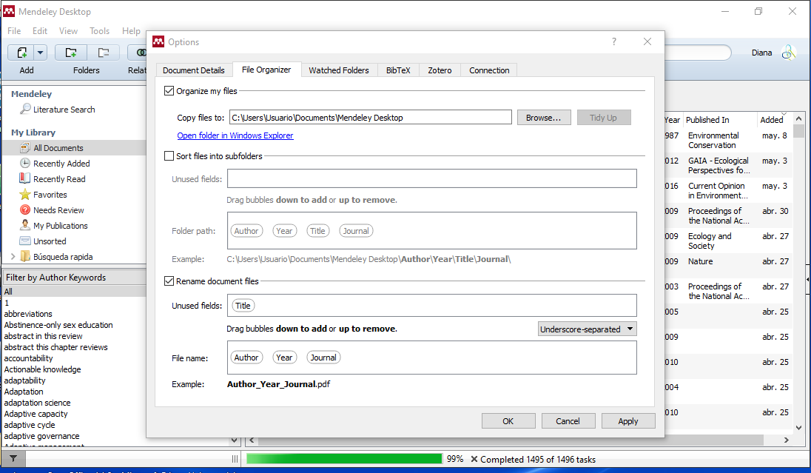

# Protocolo de uso de repositorios documentales
* * *

## Objetivo y alcance

**Objetivo:** Gestionar y respaldar los respositorios documentales y sus respectivas citas bibliográficas de los proyectos desarrollados por el Área de Planeación Colaborativa (APC).

**Alcance:** Aplica para los repositorios documentales y las citas bibliográficas de los proyectos desarrollados por el APC.

* * *
## Protocolo

Los repositorios documentales y la forma de citarlos en los informes generados en el Área es importante para el buen desarrollo de los proyectos en APC. A continuación se describe la forma de gestionarlos:

* * *
## Materiales, equipos y reactivos

Equipo de cómputo y programa Mendeley.

* * *

## Actividades y responsables

#### Responsable del respaldo y gestión de los repositorios

El responsable del manejo de los activos de información es el encargado del respaldo y gestión de los repositorios documentales de los proyectos.

Sus actividades serán:

* Crear las cuentas en Mendeley por proyecto
* Dar de alta los documentos bibliográficos

#### Alta de la cuenta del proyecto en la página web de Mendeley

Al instalar el programa Mendeley hay que dar de alta la cuenta del proyecto. La cuenta se da de alta en la página web de Mendeley. Donde se pondrá el nombre de usuario y contraseña. Además se le asigna un nombre, una descripción del proyecto y se selecciona que sólo por invitación se va a tener acceso a la cuenta.

#### Mendeley desktop

Se ingresa con el nombre de usuario y contraseña y se procede a hacer el siguiente procedimiento para que los documentos se citen bajo el formato APA:

* Ir a "tools" y dar click en "options"
* Ir a la pestaña "File Organizer", y activar "Organize my files" para poner la ruta donde se guardarán los documentos.
* Seleccionar el subtítulo "Rename document files" y arrastrar "Author", "Year" y "Journal" en el apartado de "File name"
* Seleccionar "Underscore-separeted"
* Dar click a "OK"

**Figura 1.** Pestaña "File Organizer".

#### Verificación de metadatos

Al dar de alta un documento es importante verificar que se hayan registrados los metadatos del documento en forma correcta (Autor(es), año, título, revista, libro, editorial, número, páginas, etc.).

Es necesario que se siga este procedimiento porque sino se hace así se pueden generar duplicados y triplicados de la información documental respaldada. Si el programa borra los documentos al sincronizar, se debe restaurar en Dropbox

#### Reglas de uso

* Tener una cuenta de Mendeley por proyecto
* Enviar PDF y/o link de la información documental a respaldar en el repositorio de los proyectos. En casos raros, enviar la referencia del documento
* No se respaldarán documentos de trabajo
* Hacer respaldos previos de los documentos a respaldar.
